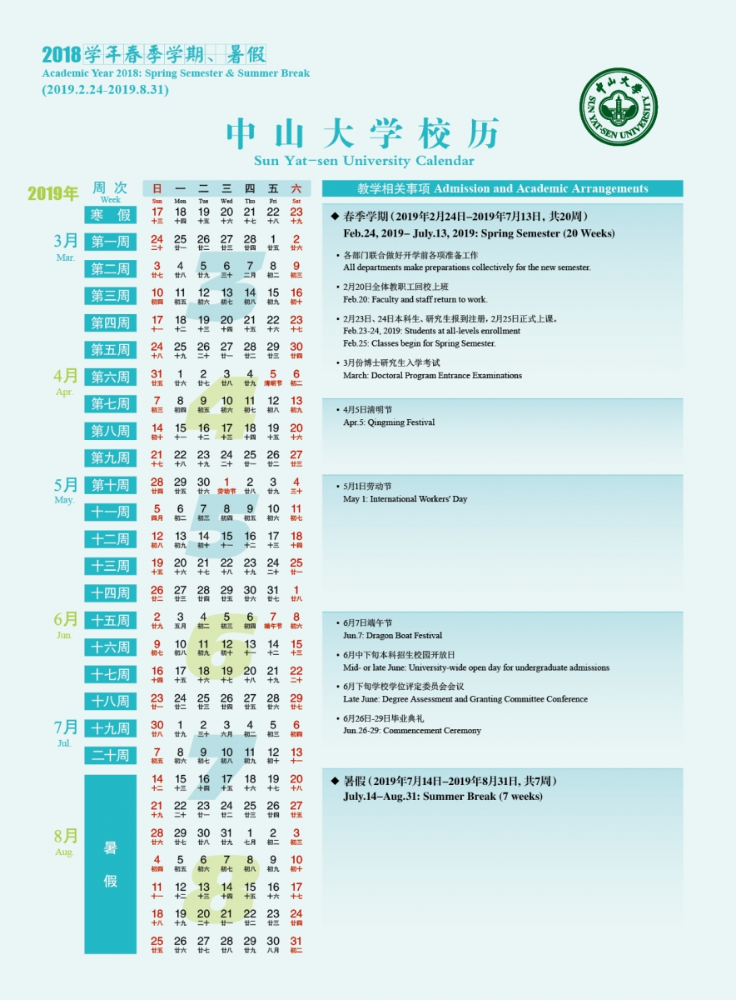
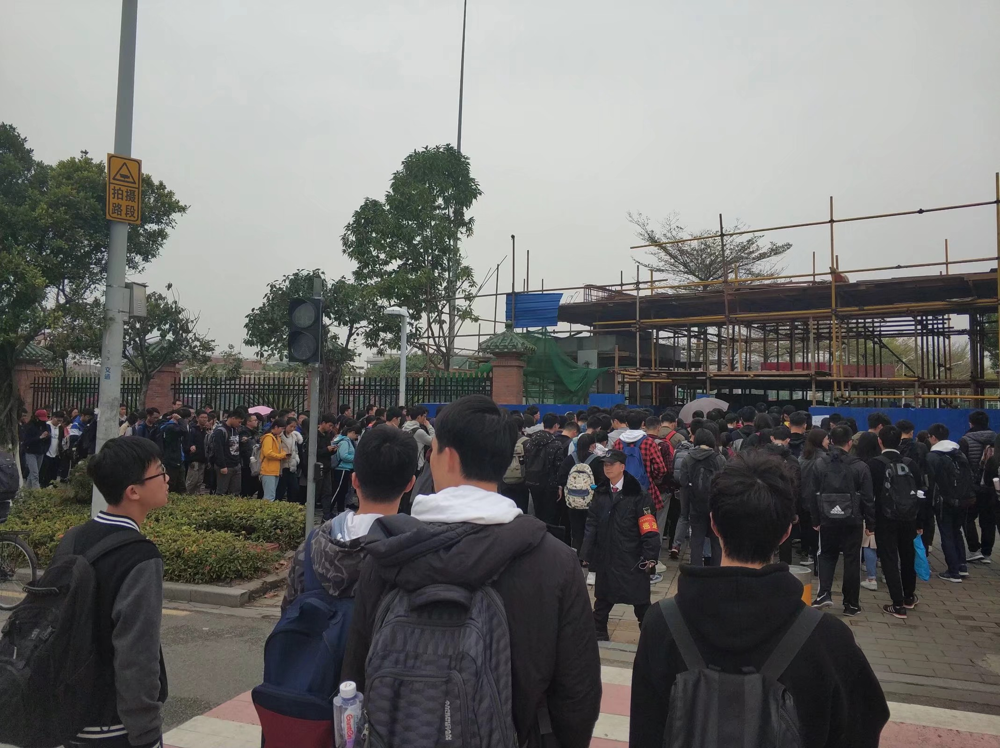
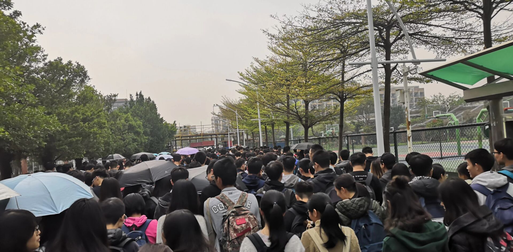
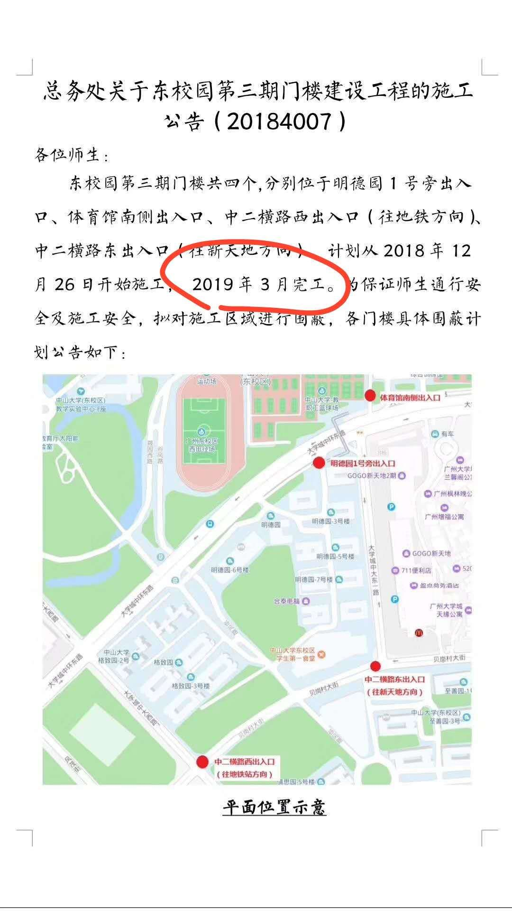

# 21weeks.ICU

`21weeks.ICU` 代指 “985211”：晚 9 早 8 每周 5 天，21 周 1 学期。学习 985211，生病 ICU。在 SYSU，这是学生之间的一种自嘲的说法，意思是按照 985211 的模式学习，在期末的考试大概率就要住 ICU 了（需要指出 18 年 1 月考试周期间共出动了 9 趟救护车）。

## 相关报道

- [教务部关于2019学年第一学期（秋季学期）排课工作的通知](http://jwb.sysu.edu.cn/content/47019?from=timeline&isappinstalled=0)  

- [中山大学校历](http://jwb.sysu.edu.cn/calendar)  
  
- [教务部最新情况通知](http://jwb.sysu.edu.cn/content/47020)  

**注：情况通知解释了之前除夕上课的“不准确信息”，即除夕不需要上课或者考试。但该通知与发布时的 2018 学年的校历是冲突的（暑假时间冲突）**  

待补充

## 什么是 985？

“985” 学习制，指的是一种越来越流行的非官方工作制（早上 8 点 ~ 晚上 9 点，每周 5 天）。这只是在课堂时间，不包括课后完成作业、项目、实习的时间。在一个实行 “985” 学习制的学校学习就意味着每周至少要上课 55 个小时（不包括完成作业时间的每周至少 10 小时以上）。

## 什么是 211？

“211” 学期制，指的是一种新颖的教学制度，即 21 周一学期。这样每一年学的教学周达到了 42 周，超出常规 40 周范围。这会极大压缩学生的课外活动、学习、实习、工作时间。  

“211” 学期制排课周次为第 1-9、11-19 周，合计共 18 周，每门课程排课所占周次合计不超过 18 周。第 10、20、21 周为考试周。  

(**未证实消息 1**) 据传从2019年秋季学期开始，所有专业课和公选课都必须要考试。  

## 我能做什么？

欢迎在社交网络中转发 [21Weeks.ICU](https://21weeks.icu)，让更多的人知道。

如果你想发言：

[SYSU匿名留言板](http://sysu.world/) sysu.world

或者：
1. 登录自己的 GitHub 账号（建议开小号）
2. 按右上角按钮 `fork` 本仓库到自己账号中
3. `git clone` 自己的仓库到本地
4. `git checkout -b "新的分支名称"` 创建新分支
5. 开始编辑
6. `git add .` 保存修改，`git commit -m "简单说一下做了什么修改"` 提交修改
7. `git push origin 分支名` 推送到自己仓库
8. 在自己的仓库中开 `Pull Request` 提交合并
9. 完成，等待合并

你也可以在自己的仓库中直接使用 GitHub 提供的网页版编辑器编辑内容再提交合并请求。

## 原则和目的

- 21weeks.ICU 是 SYSU 在读者发起的一项倡议，我们欢迎其他学校的人士加入讨论。

- 我们欢迎一切积极的、具有建设性意义的建议，倡导成熟的、负责任的发言。

- 我们拒绝任何调侃性的内容，拒绝人身攻击，拒绝违反中华人民共和国法律的内容，不传谣造谣。

## 讨论

如果你想更多地发表自己的看法，请新建一个 `.md` 文件并在下面添加到你的页面的超链接。

### [我们需要什么？](/Iwant.md)
### [中山大学原校长黄达人：大学的本质在于平等对待每位学生](/equality.md)

## 21weeks.ICU 大事记

1. 2019 年 4 月 3 日，教务部发布 2019 学年秋季学期排课通知，将秋季学期时间延长为 21 周 。
2. 许多同学以 9 月 1 日作为秋季学期开学时间，推算出秋季学期将会延长至 2020 年 1 月 24 日（除夕）。
3. 2019 年 4 月 3 日，教务部发布澄清声明，称 2019 年秋季学期的开学时间为 8 月 26 日，但根据学校于 2018 年发布的 2018 学年校历，2019 年的暑假时间为 7 月 14 日到 8 月 31 日。  

未完待续  

## 附记：SYSU东校区建墙修门记录  

（初始修墙记录缺失）

开学后发现体育馆南门围墙封闭，学生苦于只能绕行地道，一时间怨声载道。

然而等到开学竟有人从围墙进入教学区，原来是围栏上开了一条缝，这便是 “狗洞” 的起源

众人得知有此等好事，纷纷加入 “狗洞” 群体。眼看着就流量爆满了，此后狗洞被扩宽了一些，形式上分为了上下行，但这仍不足以支持巨大的人流，每到课点都是一望无际的人海，而下雨天更是不得了，以下是前线记者发来的报道

诡异的是 “狗洞” 一直处于这种毫无进展的荒废状态，广大学生也日益不满，后来我们从通知了解到体育馆南门在 3 月完工，鉴于 3 月已过且 “狗洞” 无人维护，可推论这是 “完工” 的南门吧。

